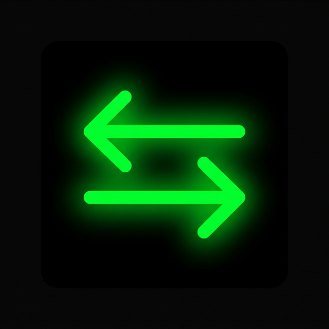
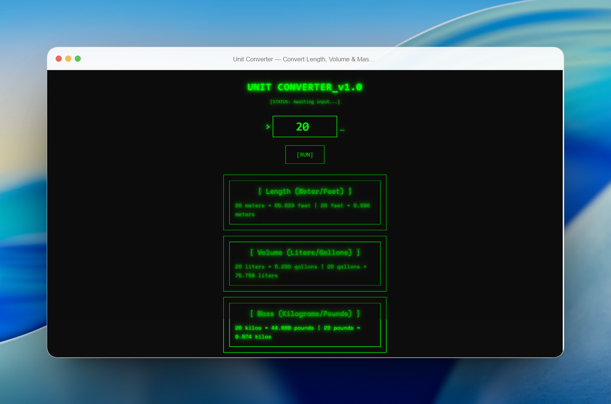

<div align="center">
  

  # Unit Converter

  *A retro CRT terminal that converts length, volume, and mass — built iteratively with AI pair programming.*

  [](https://unit-convert-six.vercel.app/)
  [](https://github.com/EdGonzz/unit-convert)
  [](https://vite.dev/)
  [](https://tailwindcss.com/)
  [](LICENSE)

  [Live Demo](https://unit-convert-six.vercel.app/) · [Features](#features) · [The Journey](#the-journey--human--ai) · [Tech Stack](#tech-stack) · [Getting Started](#getting-started)

</div>

---

<div align="center">
  
</div>

## What is this?

A frontend-only unit converter with a **retro CRT terminal aesthetic** — complete with scanline animations, glowing green text, and a typewriter effect that makes every conversion feel like you're hacking into a mainframe.

But this project isn't about the converter itself. **It's about the process.**

This is a documented case study of building a side project from scratch using AI as a pair programmer. Every commit, every refactor, every optimization was a deliberate collaboration between a human developer and an AI assistant. The timeline below shows exactly how that played out.

## Features

- **Instant conversion** between meters/feet, liters/gallons, and kilograms/pounds
- **Typewriter animation** on results with cancellation support
- **CRT scanline overlay** — pure CSS, zero JavaScript
- **Mount-once, patch-later rendering** — ~8x faster than full DOM replacement
- **Accessible** — `aria-live` regions, keyboard navigation, screen-reader labels
- **SEO-ready** — Open Graph, Twitter Cards, JSON-LD structured data, sitemap
- **Zero frameworks** — vanilla JS with JSDoc types, ~179 lines of source code

## The Journey — Human × AI

This project was built across multiple sessions, each one pushing the codebase forward through deliberate collaboration. Here's how it evolved:

```
┌─────────────────────────────────────────────────────────────────────────┐
│                         PROJECT TIMELINE                               │
├────────────┬────────────────────────────────────────────────────────────┤
│    DATE    │  MILESTONE                                                │
├────────────┼────────────────────────────────────────────────────────────┤
│            │                                                           │
│  Feb 01    │  ░░ PHASE 1 — Foundation                                 │
│     ·      │  Initialize project: Vite + pnpm + Tailwind CSS          │
│     ·      │  Build basic HTML/JS structure                           │
│     ·      │  Implement conversion logic (length, volume, mass)       │
│     ·      │  Componentize UI: Header + ResultCard                    │
│     ·      │  Apply retro CRT terminal theme                         │
│     ·      │  Add typewriter effect + input event listeners           │
│            │                                                           │
│  Feb 12    │  ░░ LICENSE                                              │
│     ·      │  Add MIT License                                         │
│            │                                                           │
│  Mar 09    │  ░░ PHASE 2 — Security & Quality (AI-assisted PRs)       │
│     ·      │  PR #1: Fix XSS vulnerability in typeWriter (textContent)│
│     ·      │  PR #2: Optimize ResultCard string computations          │
│     ·      │  PR #3: Add unit tests for format() utility              │
│            │                                                           │
│  Mar 10    │  ░░ PHASE 3 — Architecture & Performance                 │
│     ·      │  Extract conversion logic into dedicated module          │
│     ·      │  Extract handleInputChange for cleaner rendering         │
│     ·      │  Stabilize typeWriter animation + testability            │
│     ·      │  Implement targeted DOM updates (8x speedup)             │
│     ·      │  Add render performance benchmark test                   │
│            │                                                           │
│  Mar 10    │  ░░ PHASE 4 — SEO & Accessibility                       │
│     ·      │  PR #4: Full meta tags, JSON-LD, semantic HTML           │
│     ·      │  Add sitemap.xml + robots.txt                            │
│     ·      │  Create favicon and OG image                             │
│     ·      │  Add noscript fallback for crawlers                      │
│            │                                                           │
│  Mar 10    │  ░░ PHASE 5 — Documentation & AI Context                 │
│     ·      │  Create GEMINI.md (AI project context)                   │
│     ·      │  Set up Notion task tracking                             │
│     ·      │  Write this README                                       │
│            │                                                           │
└────────────┴────────────────────────────────────────────────────────────┘
```

### What the AI did vs. what the human did

| Aspect | Human (EdGonzz) | AI Assistant |
|--------|-----------------|--------------|
| **Vision** | Defined the retro CRT concept and chose the aesthetic | — |
| **Architecture** | Decided on vanilla JS, no frameworks | Suggested mount-once/patch-later pattern |
| **Security** | Identified the need for XSS review | Found the vulnerability, wrote the fix |
| **Performance** | Asked "can we make this faster?" | Implemented targeted DOM updates, wrote benchmark |
| **Testing** | Decided which areas needed tests | Wrote test suites, including roundtrip integrity checks |
| **SEO** | Requested SEO improvements | Implemented full meta tags, JSON-LD, sitemap, robots.txt |
| **Refactoring** | Approved each structural change | Extracted modules, separated concerns |
| **Code review** | Reviewed every PR before merging | Generated PRs via branches |
| **Documentation** | Directed what to document and how | Wrote GEMINI.md and this README |

### Lessons learned about AI pair programming

1. **AI is excellent at the "how", humans drive the "what" and "why."** Every feature started with a human decision about direction. The AI then executed with precision.
2. **Incremental iteration beats big-bang prompts.** The project evolved over 5 distinct phases — each building on the last, each validated before moving on.
3. **AI-generated PRs work.** Using AI to create feature branches with focused changes (security fix, performance optimization, test coverage) produced clean, reviewable code.
4. **Benchmarks prove value.** The AI didn't just claim "this is faster" — it wrote a benchmark test that proves the 8x speedup on every `pnpm test` run.
5. **Context files matter.** The `GEMINI.md` file gives the AI full project awareness, reducing hallucinations and keeping suggestions aligned with the codebase.

## Tech Stack

| Layer | Technology |
|-------|------------|
| Bundler | [Vite 7](https://vite.dev/) |
| Styling | [Tailwind CSS 4](https://tailwindcss.com/) |
| Font | [Space Mono](https://fonts.google.com/specimen/Space+Mono) |
| Testing | [Vitest 4](https://vitest.dev/) |
| Package Manager | [pnpm](https://pnpm.io/) |
| Deployment | [Vercel](https://vercel.com/) |
| Language | JavaScript (ESM + JSDoc typed) |

## Getting Started

### Prerequisites

- [Node.js](https://nodejs.org/) >= 20
- [pnpm](https://pnpm.io/) >= 9

### Install and run

```bash
# Clone the repository
git clone https://github.com/EdGonzz/unit-convert.git
cd unit-convert

# Install dependencies
pnpm install

# Start dev server
pnpm dev
```

### Available commands

```bash
pnpm dev          # Start Vite dev server (http://localhost:5173)
pnpm build        # Production build → dist/
pnpm preview      # Preview production build
pnpm test         # Run all 25 tests (includes performance benchmark)
pnpm test:watch   # Run tests in watch mode
```

## Project Structure

```
unit-convert/
├── index.html              # SPA entry — SEO meta, JSON-LD, noscript fallback
├── public/
│   ├── favicon.png         # App icon (glowing green arrows)
│   ├── og-image.png        # Social share preview
│   ├── robots.txt          # Crawler directives
│   └── sitemap.xml         # Search engine sitemap
└── src/
    ├── main.js             # App entry — state, mount-once render, events
    ├── style.css           # CSS vars, scanline animation, sr-only
    ├── utils.js            # format() helper
    ├── conversions.js      # Pure conversion functions + constants
    ├── dom-utils.js        # typeWriter() with cancellation support
    ├── components/
    │   ├── Header.js       # Terminal header + input + [RUN] button
    │   └── ResultCard.js   # Result card with aria-live region
    ├── conversions.test.js # 15 tests — unit + roundtrip integrity
    ├── dom-utils.test.js   # 2 tests — typewriter animation
    ├── utils.test.js       # 6 tests — format helper
    └── render-benchmark.test.js  # 2 tests — DOM update performance
```

## Performance

The app uses a **mount-once, patch-later** rendering strategy:

1. On first render, the full HTML shell is built via `innerHTML`
2. On subsequent renders, only the text nodes inside result elements are updated via `typeWriter()`
3. This preserves event listeners, avoids layout thrashing, and avoids unnecessary DOM allocation

```
┌──────────────────────────────────────────────┐
│       Render Performance Benchmark           │
├──────────────────────────────────────────────┤
│  Iterations:                       1,000 │
│  Full DOM (old):               376.42 ms │
│  Targeted (new):                46.06 ms │
│  Speedup:                          8.17x │
│  Improvement:                      87.8% │
└──────────────────────────────────────────────┘
```

> [!NOTE]
> This benchmark runs on every `pnpm test` execution, ensuring performance doesn't regress.

## Author

**EdGonzz** — [@Ed_Gonzz_](https://twitter.com/Ed_Gonzz_)

Built with curiosity, shipped with AI.
