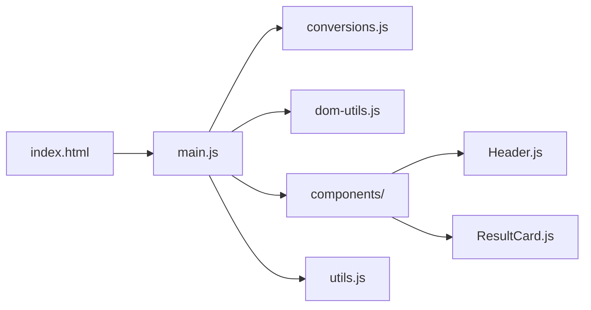

# Arquitectura — Unit Converter

> Documento técnico que describe la arquitectura del proyecto, los patrones de diseño usados y el flujo de datos.

## Visión General

Unit Converter es una **SPA (Single Page Application) frontend-only** que convierte entre unidades de medida comunes (longitud, volumen, masa). No tiene backend ni estado persistente — toda la lógica corre en el navegador del usuario.



## Stack Tecnológico

| Capa         | Tecnología                                    | Propósito                        |
| ------------ | --------------------------------------------- | -------------------------------- |
| Bundler      | **Vite 7**                                    | Dev server + build de producción |
| Estilos      | **Tailwind CSS 4** (`@tailwindcss/vite`)      | Utility-first CSS                |
| Tipografía   | **Space Mono** (`@fontsource/space-mono`)     | Fuente monoespaciada CRT         |
| Testing      | **Vitest 4** (`jsdom`)                        | Unit tests + benchmarks          |
| Despliegue   | **Vercel**                                    | CI/CD automático desde `main`    |
| Lenguaje     | **JavaScript ESM** con JSDoc para tipos       | Sin TypeScript                   |

## Estructura de Archivos

```
src/
├── main.js              # Orquestador: estado, render loop, eventos
├── style.css            # Variables CSS globales, scanlines, sr-only
├── utils.js             # Helpers puros (format)
├── conversions.js       # Funciones puras de conversión + constantes
├── dom-utils.js         # typeWriter() — animación DOM
├── components/
│   ├── Header.js        # Template del header (input + botón [RUN])
│   └── ResultCard.js    # Template de tarjeta de resultado
├── *.test.js            # Tests unitarios co-ubicados
└── render-benchmark.test.js  # Benchmarks de rendimiento
```

## Índice de Documentación

| Documento | Descripción |
|-----------|-------------|
| [Patrones de Diseño](./patrones.md) | Mount-once, template-literal components, funciones puras, typeWriter |
| [Flujo de Datos](./flujo-de-datos.md) | Diagrama de secuencia y gestión de estado |
| [Sistema de Diseño](./sistema-de-diseno.md) | Tema CRT retro, tokens CSS, efectos visuales |
| [Accesibilidad](./accesibilidad.md) | Semántica HTML5, ARIA, navegación por teclado |
| [SEO](./seo.md) | Meta tags, JSON-LD, robots.txt, sitemap |
| [Testing](./testing.md) | Estrategia de tests, archivos, runner |

---

*Última actualización: 2026-03-14*
