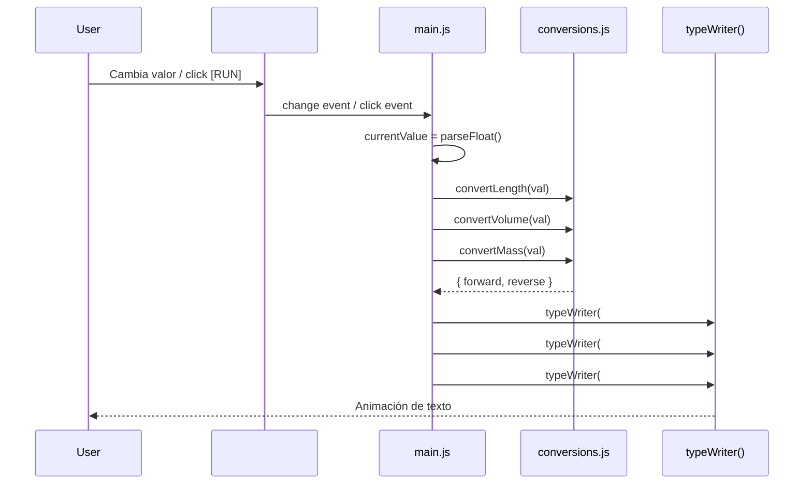

# Flujo de Datos

> Cómo viaja la información desde el input del usuario hasta la pantalla.

## Diagrama de Secuencia

## Estado de la Aplicación

El estado es **minimal y en memoria**:

| Variable          | Tipo      | Propósito                              |
| ----------------- | --------- | -------------------------------------- |
| `currentValue`    | `number`  | Valor numérico actual del input        |
| `isInitialRender` | `boolean` | Flag para distinguir mount vs. update  |

No hay store, no hay estado global complejo. Un solo módulo (`main.js`) gestiona todo el ciclo de vida.
